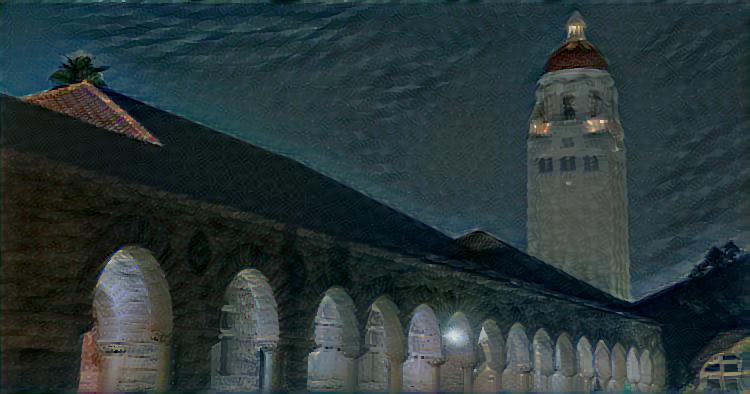
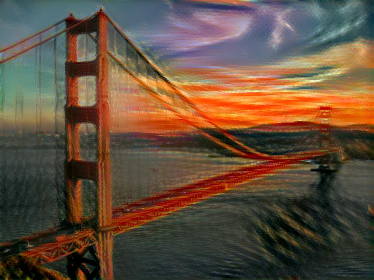
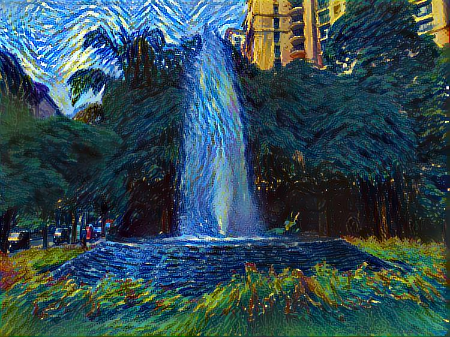

# Neural Style in Tensorflow

Yet another TensorFlow implementation of [*A Neural Algorithm of Artistic Style*](https://arxiv.org/pdf/1508.06576.pdf).

## Requirements
```
tensorflow==1.6.0
scikit-image
requests
```
## Usage
```
python stylize.py --content_image [CONTENT_IMAGE] --style_image [STYLE_IMAGE] --generated_image [GENERATED_IMAGE]
```
Please read `stylize.py` for additional options.
## Samples



